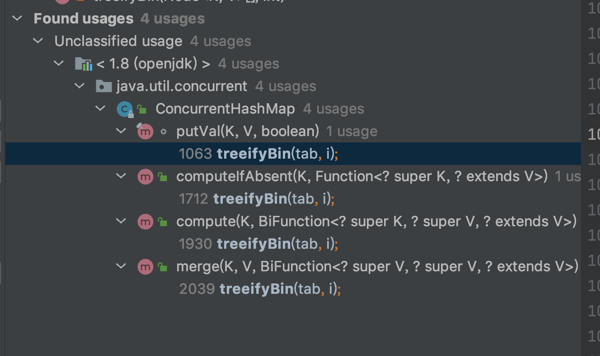
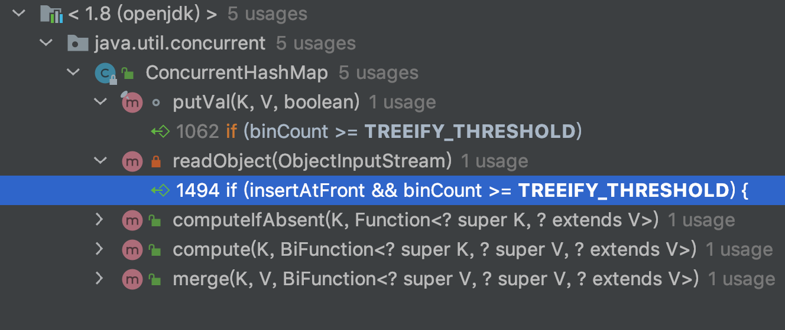
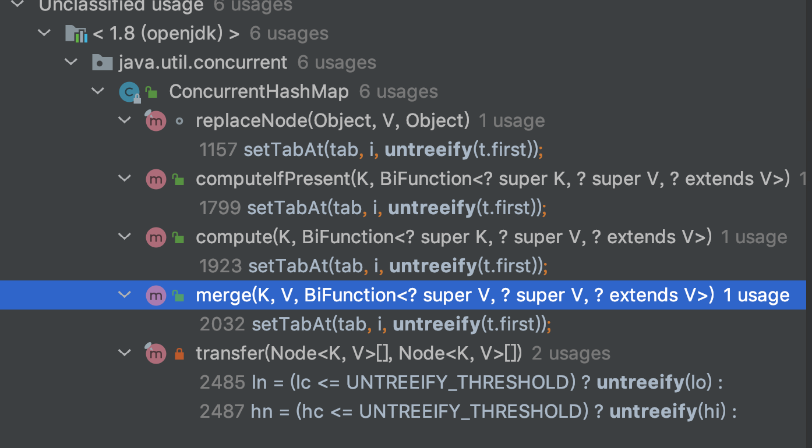

# ConcurrentHashMap红黑树和链表互转分析

​		先说明，本文基于JDK1.8。

​		网上很多错误言论会说当发生hash冲突的节点上的list大小超过8就会转换成红黑树，小于6就会转换回链表，在看了源码之后才知道我受到了深深的欺骗，情况并没有想象的那么简单！接下来，我就要结合源码分析一下这两种情况。

[toc]

## 链表转换成红黑树

​		链表转换成红黑树，首先我们一定会想到是在put新元素的时候发生，那么来看看putVal这个方法：

### putVal

```java
final V putVal(K key, V value, boolean onlyIfAbsent) {
    if (key == null || value == null) throw new NullPointerException();
    int hash = spread(key.hashCode());
    int binCount = 0;//用于记录发生hash冲突的节点上的元素数量
    for (Node<K,V>[] tab = table;;) {
        Node<K,V> f; int n, i, fh;
        if (tab == null || (n = tab.length) == 0)
            tab = initTable();
        else if ((f = tabAt(tab, i = (n - 1) & hash)) == null) {
            if (casTabAt(tab, i, null,new Node<K,V>(hash, key, value, null)))
                break;                   // no lock when adding to empty bin
        }
        else if ((fh = f.hash) == MOVED)
            tab = helpTransfer(tab, f);
        else {
            V oldVal = null;
            synchronized (f) {
								//...省略发生hash冲突时新元素添加的过程
            }
            if (binCount != 0) {
                if (binCount >= TREEIFY_THRESHOLD)//TREEIFY_THRESHOLD值为8
                    treeifyBin(tab, i);//调用转换红黑树的方法
                if (oldVal != null)
                    return oldVal;
                break;
            }
        }
    }
    addCount(1L, binCount);//元素总数量的增加，以及扩容的处理
    return null;
}
```

​		当发生hash冲突时，这个冲突节点上的元素总量大于8的话就会去调用转换红黑树的方法`treeifyBin`

### treeifyBin

```java
private final void treeifyBin(Node<K,V>[] tab, int index) {
    Node<K,V> b; int n, sc;
    if (tab != null) {
        if ((n = tab.length) < MIN_TREEIFY_CAPACITY)//MIN_TREEIFY_CAPACITY 值为64
            tryPresize(n << 1);//尝试扩容
        else if ((b = tabAt(tab, index)) != null && b.hash >= 0) {
          	//构建红黑树
            synchronized (b) {
                if (tabAt(tab, index) == b) {
                    TreeNode<K,V> hd = null, tl = null;
                    for (Node<K,V> e = b; e != null; e = e.next) {
                        TreeNode<K,V> p =
                            new TreeNode<K,V>(e.hash, e.key, e.val,
                                              null, null);
                        if ((p.prev = tl) == null)
                            hd = p;
                        else
                            tl.next = p;
                        tl = p;
                    }
                    setTabAt(tab, index, new TreeBin<K,V>(hd));
                }
            }
        }
    }
}
```

​		进入方法会先判断ConcurrentHashMap的元素总数是不是超过64，如果不超过，是优先进行扩容的，而不是转换成红黑树。

​		再来看一下这个treeifyBin方法都在哪被调用了，如下图：		

​		挨个查看了一下，都是判断冲突节点上元素个数大于8就会调用它。

​		再来查看下`static final int TREEIFY_THRESHOLD = 8;`这个常量都在哪被使用了，看看有没有遗漏的地方。

### TREEIFY_THRESHOLD



​		这么一找发现，确实有个readObject方法前面没有遇到，看看它是干嘛用的：

### readObject

```java
private void readObject(java.io.ObjectInputStream s) throws java.io.IOException, ClassNotFoundException {
    //...
    if (size == 0L)
        sizeCtl = 0;
    else {
        //...
        while (p != null) {
            boolean insertAtFront;
            Node<K,V> next = p.next, first;
            int h = p.hash, j = h & mask;
            if ((first = tabAt(tab, j)) == null)
                insertAtFront = true;
            else {
                K k = p.key;
                if (first.hash < 0) {
										//...
                }
                else {
                    int binCount = 0;
                    insertAtFront = true;
                    Node<K,V> q; K qk;
                    for (q = first; q != null; q = q.next) {
                        //...
                        ++binCount;
                    }
                  	//大于8转换成红黑树
                    if (insertAtFront && binCount >= TREEIFY_THRESHOLD) { //TREEIFY_THRESHOLD 值为8
                        insertAtFront = false;
                        ++added;
                        p.next = first;
                        TreeNode<K,V> hd = null, tl = null;
                        for (q = p; q != null; q = q.next) {
                            TreeNode<K,V> t = new TreeNode<K,V> //构造树节点
                                (q.hash, q.key, q.val, null, null);
                            if ((t.prev = tl) == null)
                                hd = t;
                            else
                                tl.next = t;
                            tl = t;
                        }
                        setTabAt(tab, j, new TreeBin<K,V>(hd));
                    }
                }
            }
						//...
        }
        //...
    }
}
```

​		原来这个方法是反序列化用的，在反序列化的时候，某个节点的hash冲突元素数量超过8也是会用红黑树去存储的。

​		至此，链表转换成红黑树的时机也就摸清了。


## 红黑树转换回链表

​		想让红黑树退化成链表，首先很容易想到的一定是删除了元素导致的，所以我们先从删除这条线往下摸一摸。

​		来到`java.util.concurrent.ConcurrentHashMap#remove(java.lang.Object)`方法，他时机调用的是replaceNode方法，继续跟进：

### remove

```java
public V remove(Object key) {
    return replaceNode(key, null, null);
}

final V replaceNode(Object key, V value, Object cv) {
        int hash = spread(key.hashCode());
        for (Node<K,V>[] tab = table;;) {
            Node<K,V> f; int n, i, fh;
            if (tab == null || (n = tab.length) == 0 || (f = tabAt(tab, i = (n - 1) & hash)) == null)
                break;
            else if ((fh = f.hash) == MOVED)
                tab = helpTransfer(tab, f);
            else {
                V oldVal = null;
                boolean validated = false;
                synchronized (f) {
                    if (tabAt(tab, i) == f) {
                        if (fh >= 0) {
                           	//...
                        }
                        else if (f instanceof TreeBin) { //如果这个节点是红黑树节点
                            validated = true;
                            TreeBin<K,V> t = (TreeBin<K,V>)f;
                            TreeNode<K,V> r, p;
                            if ((r = t.root) != null &&
                                (p = r.findTreeNode(hash, key, null)) != null) {
                                V pv = p.val;
                                if (cv == null || cv == pv ||
                                    (pv != null && cv.equals(pv))) {
                                    oldVal = pv;
                                    if (value != null)
                                        p.val = value;
                                    else if (t.removeTreeNode(p)) //删除树上的节点
                                        setTabAt(tab, i, untreeify(t.first));//将节点设为链表，清除红黑树
                                }
                            }
                        }
                    }
                }
								//...
            }
        }
        return null;
}
```

​		当你调用removeTreeNode方法来删除树上的节点时，如果返回的是true，那么就会将这个红黑树退化回链表（untreeify这个方法是转换的方法，里面没什么特殊的判断逻辑，就不深入看了）。那么究竟什么情况下，removeTreeNode方法会返回true呢？这个方法比较长，我会留下关键的代码进行讨论：

### removeTreeNode

```java
final boolean removeTreeNode(TreeNode<K,V> p) {
    TreeNode<K,V> next = (TreeNode<K,V>)p.next;
    TreeNode<K,V> pred = p.prev;  // unlink traversal pointers
    TreeNode<K,V> r, rl;
    if (pred == null)
        first = next;
    else
        pred.next = next;
    if (next != null)
        next.prev = pred;
    if (first == null) {
        root = null;
        return true;  //其中一处
    }
    if ((r = root) == null || r.right == null || // too small
        (rl = r.left) == null || rl.left == null)
        return true; //另一处
  
    //...省略很长一段删除node的过程
    return false;
}
```

​		可以看到，有两处返回了true。

* 第一处：TreeBin的链表结构的first指针为null时返回true。

* 第二处：看注释能看出来，树太小了，也返回true

    再来看看untreeify都有哪调用了，是否还有其他方式会使红黑树转换成链表：



​		这些调用中，除了transfer方法，其余都和上面讲的逻辑一样，所以接下来就是来分析transfer方法中的红黑树退化条件。

### transfer

```java
private final void transfer(Node<K,V>[] tab, Node<K,V>[] nextTab) {
		//...
    for (int i = 0, bound = 0;;) {
        Node<K,V> f; int fh;
        while (advance) {
						//...
        }
				//...
        else {
            synchronized (f) {
 										//...
                    else if (f instanceof TreeBin) {
                        TreeBin<K,V> t = (TreeBin<K,V>)f;
                        TreeNode<K,V> lo = null, loTail = null;
                        TreeNode<K,V> hi = null, hiTail = null;
                        int lc = 0, hc = 0;
                        for (Node<K,V> e = t.first; e != null; e = e.next) {
													//...
                        }
                      	//判断低位是否需要树退化
                        ln = (lc <= UNTREEIFY_THRESHOLD) ? untreeify(lo) : //UNTREEIFY_THRESHOLD 值为6
                            (hc != 0) ? new TreeBin<K,V>(lo) : t;
                        //判断高位是否需要树退化
                      	hn = (hc <= UNTREEIFY_THRESHOLD) ? untreeify(hi) :
                            (lc != 0) ? new TreeBin<K,V>(hi) : t;
                        setTabAt(nextTab, i, ln);
                        setTabAt(nextTab, i + n, hn);
                        setTabAt(tab, i, fwd);
                        advance = true;
                    }
                }
            }
        }
    }
}
```

​		transfer方法是扩容时用来迁移数据的，由于扩容时，容器容量变化，导致元素的hash值可能发生变化，所以有的数据可能会被迁移走，这就导致了某个节点下的元素可能变少，当数量小于6时，就会触发将红黑树退化成链表的动作。

### UNTREEIFY_THRESHOLD

​		接着又查看了下`static final int UNTREEIFY_THRESHOLD = 6;`变量，发现没有其他地方对其进行引用了，至此红黑树退化回链表的时机也分析完毕。


## 总结

* 链表→红黑树：
    * 当插入新元素时，hash冲突节点上的元素个数大于等于8且容器内元素总数大于等于64时
    * 当反序列化时，hash冲突节点上的元素个数大于等于8
* 红黑树→链表：
    * 当remove元素时，如果经过判断，树太小时
    * 当扩容时，数据迁移时，低位和高位部分的元素数量小于6时
* 个人见解，若有错误，欢迎指出


欢迎关注我的个人微信公众号`ymxd-it`，也可扫下面的码关注：


