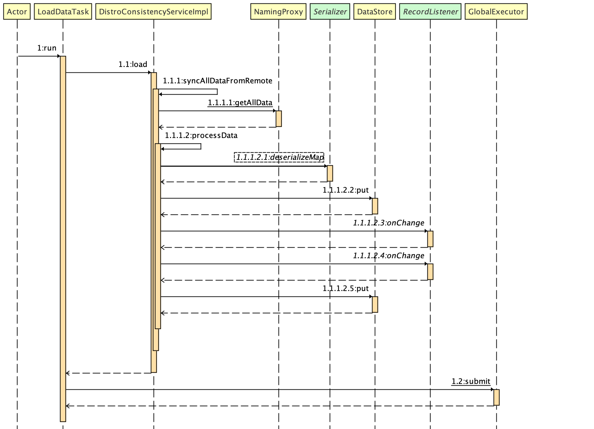

# Nacos-注册中心-一致性协议Distro

[TOC]


## Distro

* Distro是一个Nacos自创的AP模型的一致性协议，他专门为注册中心的数据同步而设计。
* 每个Nacos的Server节点只负责一部分请求。被@CanDistro标记的方法会被转发到对应的节点上处理（目前只有“写”接口）。
* 服务信息改变后会通知其余健康的节点。
* 当Server刚启动时，会从其余健康机器上将数据同步过来。


## 服务变更

​		我们先来看看在注册时候，Distro协议都干了些什么。

​		入口就是`com.alibaba.nacos.naming.core.ServiceManager#addInstance` ，这个方法在服务注册篇讲过，但是涉及到一致性的部分没有深入研究。下图是这一过程的时序图：


​		首先看addInstance方法，他将实例信息交给了一致性处理类，而我们使用的是临时节点，所以走到Distro协议实现类`DistroConsistencyServiceImpl` 中的put方法，来看一下这个方法的实现：

```java
@Override
public void put(String key, Record value) throws NacosException {
  	//本地数据更新
    onPut(key, value);
    //同步给其他健康节点
    taskDispatcher.addTask(key);
}

public void onPut(String key, Record value) {
  if (KeyBuilder.matchEphemeralInstanceListKey(key)) {
    Datum<Instances> datum = new Datum<>();//封装数据
    datum.value = (Instances) value;
    datum.key = key;
    datum.timestamp.incrementAndGet();
    dataStore.put(key, datum);//加入本地数据缓存
  }

  if (!listeners.containsKey(key)) {
    return;
  }
	//发信息变更通知
  notifier.addTask(key, ApplyAction.CHANGE);
}
```

​		将新的数据进行封装，并交给本地缓存进行存储，然后通过notifier的任务发送通知更新本地数据。再通过taskDispatcher的任务将数据同步给其他Nacos节点。

```java
//com.alibaba.nacos.naming.consistency.ephemeral.distro.DistroConsistencyServiceImpl.Notifier

public void addTask(String datumKey, ApplyAction action) {

    if (services.containsKey(datumKey) && action == ApplyAction.CHANGE) {
        return;
    }
    if (action == ApplyAction.CHANGE) {
        services.put(datumKey, StringUtils.EMPTY);
    }
    tasks.add(Pair.with(datumKey, action));
}

//处理任务的方法
@Override
public void run() {
  while (true) {
    try {
			//捞出任务
      Pair pair = tasks.take();
			//...
      String datumKey = (String) pair.getValue0();
      ApplyAction action = (ApplyAction) pair.getValue1();
      services.remove(datumKey);
      int count = 0;
			//...
      for (RecordListener listener : listeners.get(datumKey)) {
        count++;
        try {
          if (action == ApplyAction.CHANGE) {
            //修改数据
            listener.onChange(datumKey, dataStore.get(datumKey).value);
            continue;
          }
          if (action == ApplyAction.DELETE) {
            listener.onDelete(datumKey);
            continue;
          }
        } catch (Throwable e) {
        }
      }
    } catch (Throwable e) {
    }
  }
}
```

​		notifier.addTask将任务投递给任务队列，然后run方法进行消费。通过调用listener.onChange来实现本地数据的更新。listenner其实就是service：

```java
//com.alibaba.nacos.naming.core.Service#onChange
@Override
public void onChange(String key, Instances value) throws Exception {
    for (Instance instance : value.getInstanceList()) {
        if (instance == null) {
            // Reject this abnormal instance list:
            throw new RuntimeException("got null instance " + key);
        }
        if (instance.getWeight() > 10000.0D) {
            instance.setWeight(10000.0D);
        }
        if (instance.getWeight() < 0.01D && instance.getWeight() > 0.0D) {
            instance.setWeight(0.01D);
        }
    }
		//更新ip
    updateIPs(value.getInstanceList(), KeyBuilder.matchEphemeralInstanceListKey(key));
		//从新计算校验和
    recalculateChecksum();
}
```

​		onChange方法先进行简单的校验，然后调用updateIPs更新ip等信息，最后从新计算校验和。

​		再来看看taskDispatcher.addTask是如何同步给其他Nacos节点的：

```java
//com.alibaba.nacos.naming.consistency.ephemeral.distro.TaskDispatcher#addTask
public void addTask(String key) {
    taskSchedulerList.get(UtilsAndCommons.shakeUp(key, cpuCoreCount)).addTask(key);
}

//com.alibaba.nacos.naming.consistency.ephemeral.distro.TaskDispatcher.TaskScheduler#addTask
public void addTask(String key) {
  queue.offer(key);
}

@Override
public void run() {
  List<String> keys = new ArrayList<>();
  while (true) {
    try {
			//获取任务
      String key = queue.poll(partitionConfig.getTaskDispatchPeriod(),TimeUnit.MILLISECONDS);
			//校验省略...
      keys.add(key);
      //数据同步任务计数
      dataSize++;
      //符合条件才同步
      if (dataSize == partitionConfig.getBatchSyncKeyCount() ||
          (System.currentTimeMillis() - lastDispatchTime) > partitionConfig.getTaskDispatchPeriod()) {
        //获取能正常同步的nacos节点
        for (Server member : dataSyncer.getServers()) {
          if (NetUtils.localServer().equals(member.getKey())) {
            continue;
          }
          SyncTask syncTask = new SyncTask();
          syncTask.setKeys(keys);
          syncTask.setTargetServer(member.getKey());
					//...
          //提交任务给数据同步类
          dataSyncer.submit(syncTask, 0);
        }
        lastDispatchTime = System.currentTimeMillis();
        dataSize = 0;
      }
    } catch (Exception e) {
    }
  }
}
```

​		先根据key唤醒一个线程来执行任务。执行任务的类是TaskScheduler，它的addTask方法其实就是将任务加到阻塞队列中，再有run方法进行消费。但是需要符合一定条件才能进行同步，一是任务数量达到了设定的数量（默认1000），另一种是距离上次同步超过了设定的时间间隔（默认30s），就会进行数据同步。

​		然后选择能正常同步的健康节点，将key和节点信息封装成一个任务，交由数据同步器dataSyncer去进行同步。		

​		数据同步器实际调用的是`com.alibaba.nacos.naming.misc.NamingProxy#syncData`接口，也就是通过API方式调用其他节点，调用的方法是`/distro/datum`：

```java
//com.alibaba.nacos.naming.controllers.DistroController
@PutMapping("/datum")
public ResponseEntity onSyncDatum(@RequestBody Map<String, Datum<Instances>> dataMap) throws Exception {
    //...
    for (Map.Entry<String, Datum<Instances>> entry : dataMap.entrySet()) {
        if (KeyBuilder.matchEphemeralInstanceListKey(entry.getKey())) {
            String namespaceId = KeyBuilder.getNamespace(entry.getKey());
            String serviceName = KeyBuilder.getServiceName(entry.getKey());
            if (!serviceManager.containService(namespaceId, serviceName)
                && switchDomain.isDefaultInstanceEphemeral()) {
              	//创建service
                serviceManager.createEmptyService(namespaceId, serviceName, true);
            }
          	//修改数据
            consistencyService.onPut(entry.getKey(), entry.getValue().value);
        }
    }
    return ResponseEntity.ok("ok");
}
```

​		这个API接口就是根据key去查找有没有这个数据，没有就创建空的service，有就直接更新。createEmptyService和onPut方法前文都已经介绍过。


## 启动加载

​		以上是在运行时当有数据发生变化时所要进行的动作。那么在一个新的Nacos节点启动加入集群时，数据又是怎么进行同步的呢。这是我们这一小节将要分析的内容。

​		这回的入口是`com.alibaba.nacos.naming.consistency.ephemeral.distro.DistroConsistencyServiceImpl.LoadDataTask`类，LoadDataTask会在DistroConsistencyServiceImpl初始化之后进行触发，来看一下这个类：

```java
private class LoadDataTask implements Runnable {
    @Override
    public void run() {
        try {
          	//加载
            load();
            if (!initialized) {//判断是否初始化过了
                GlobalExecutor.submit(this, globalConfig.getLoadDataRetryDelayMillis());//默认30s
            }
        } catch (Exception e) {
        }
    }
}
```

​		接下来，加载数据的整个时序图如下：



​		load方法中关键的方法是syncAllDataFromRemote方法，它用来从其他健康的Nacos节点获取数据。而syncAllDataFromRemote方法中有两个关键方法：一个是NamingProxy.getAllData方法，通过proxy使用API来获取要同步的数据；另一个是processData方法，它用来处理接收到的信息并进行更新数据。

```java
public void load() throws Exception {
    if (SystemUtils.STANDALONE_MODE) {
        initialized = true;
        return;
    }
    // size = 1 means only myself in the list, we need at least one another server alive:
    while (serverListManager.getHealthyServers().size() <= 1) {
        Thread.sleep(1000L);
        Loggers.DISTRO.info("waiting server list init...");
    }

    for (Server server : serverListManager.getHealthyServers()) {
        if (NetUtils.localServer().equals(server.getKey())) {
            continue;
        }
        if (Loggers.DISTRO.isDebugEnabled()) {
            Loggers.DISTRO.debug("sync from " + server);
        }
        // try sync data from remote server:
        if (syncAllDataFromRemote(server)) {
            initialized = true;
            return;
        }
    }
}

public boolean syncAllDataFromRemote(Server server) {
    try {
      byte[] data = NamingProxy.getAllData(server.getKey());
      processData(data);
      return true;
    } catch (Exception e) {
      Loggers.DISTRO.error("sync full data from " + server + " failed!", e);
      return false;
    }
}
```

​		如果是单机模式，那么直接返回，不进行同步。

​		如果健康节点数≤1，那就等到再有一个节点健康再进行同步。

​		如果健康节点数>1，那就进行同步。

​		NamingProxy.getAllData这个方法实际调用的接口是`/distro/datums`，先来看一下这个接口的实现：

```java
//com.alibaba.nacos.naming.controllers.DistroController
@GetMapping("/datums")
public ResponseEntity getAllDatums() {
  String content = new String(serializer.serialize(dataStore.getDataMap()), StandardCharsets.UTF_8);
  return ResponseEntity.ok(content);
}
```

​		这个方法就非常简单，直接把本地缓存的那个map直接序列化返回了。

​		再来分析processData方法：

```java
public void processData(byte[] data) throws Exception {
    if (data.length > 0) {
      	//反序列化
        Map<String, Datum<Instances>> datumMap =
            serializer.deserializeMap(data, Instances.class);
        for (Map.Entry<String, Datum<Instances>> entry : datumMap.entrySet()) {
            dataStore.put(entry.getKey(), entry.getValue());
            if (!listeners.containsKey(entry.getKey())) {
                // pretty sure the service not exist:
                if (switchDomain.isDefaultInstanceEphemeral()) {
                    // create empty service
                    Service service = new Service();
                    String serviceName = KeyBuilder.getServiceName(entry.getKey());
                    String namespaceId = KeyBuilder.getNamespace(entry.getKey());
                    service.setName(serviceName);
                    service.setNamespaceId(namespaceId);
                    service.setGroupName(Constants.DEFAULT_GROUP);
                    // now validate the service. if failed, exception will be thrown
                    service.setLastModifiedMillis(System.currentTimeMillis());
                    service.recalculateChecksum();
                  	//注册、添加监听service
                    listeners.get(KeyBuilder.SERVICE_META_KEY_PREFIX).get(0)
                        .onChange(KeyBuilder.buildServiceMetaKey(namespaceId, serviceName), service);
                }
            }
        }
        for (Map.Entry<String, Datum<Instances>> entry : datumMap.entrySet()) {
            if (!listeners.containsKey(entry.getKey())) {
                continue;
            }
            try {
                for (RecordListener listener : listeners.get(entry.getKey())) {
                  	//更新instance数据
                    listener.onChange(entry.getKey(), entry.getValue().value);
                }
            } catch (Exception e) {
                continue;
            }
            // Update data store if listener executed successfully:
            dataStore.put(entry.getKey(), entry.getValue());
        }
    }
}
```

​		processData先将收到的数据进行反序列化；

​		如果service不存在并且是临时节点，那就构建service，并调用onChange去注册、添加监听（接下来分析）；

​		监听器更新instance数据成功，就通过dataStore更新本地缓存。

​		processData方法中，第一个onChange方法的第二个参数是service，那么它实际调用的方法应该是`com.alibaba.nacos.naming.core.ServiceManager#onChange` :

```java
@Override
public void onChange(String key, Service service) throws Exception {
    try {
        //...
        Service oldDom = getService(service.getNamespaceId(), service.getName());
        if (oldDom != null) {
            oldDom.update(service);
            // re-listen to handle the situation when the underlying listener is removed:
            consistencyService.listen(KeyBuilder.buildInstanceListKey(service.getNamespaceId(), 
                                                                      service.getName(), true), oldDom);
            consistencyService.listen(KeyBuilder.buildInstanceListKey(service.getNamespaceId(), 
                                                                      service.getName(), false), oldDom);
        } else {
            putServiceAndInit(service);
        }
    } catch (Throwable e) {
    }
}
```

​		由于这是启动加载，所以旧数据是没有的，那就会走到putServiceAndInit方法中，这个方法在服务注册篇分析过，这里就不在介绍了，它将service注册，并绑定上监听器。


## 小结

* 服务变更时，Nacos服务端会通过Notifier通知本地数据修改，并且使用TaskScheduler和Nacos其他节点进行数据同步
* 服务启动时，Naocs会启动一个LoadDataTask线程从其余健康实例中，将数据拉过来，再通过processData方法进行处理
* Distro属于AP模式，参考了内部 ConfigServer 和开源 Eureka，在不借助第三方存储的情况下，实现基本大同小异。
    