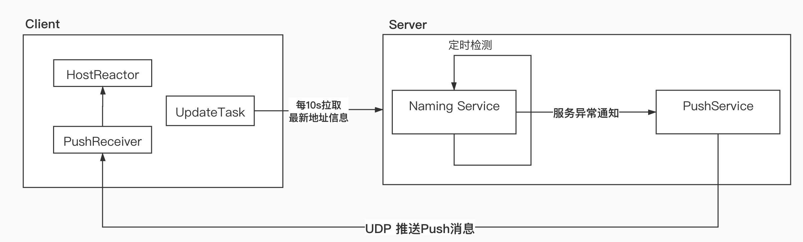

# Nacos-注册中心-服务发现

[toc]

## 服务地址查询

​		OpenAPI形式为：

```shell
curl -X GET 'http://127.0.0.1:8848/nacos/v1/ns/instance/list?serviceName=nacos.naming.serviceName'
```

​		找到入口后，我们直接来Nacos-Naming模块下的InstanceController中：

```java
@GetMapping("/list")
public JSONObject list(HttpServletRequest request) throws Exception {
  	//获取参数省略...
  
    return doSrvIPXT(namespaceId, serviceName, agent, clusters, clientIP, udpPort, env, 
                     isCheck, app, tenant,healthyOnly);
}

public JSONObject doSrvIPXT(String namespaceId, String serviceName, String agent, String 
                            clusters, String clientIP,int udpPort,String env, 
                            boolean isCheck, String app, String tid, boolean healthyOnly)
  													throws Exception {

  ClientInfo clientInfo = new ClientInfo(agent);
  JSONObject result = new JSONObject();
  //获取service
  Service service = serviceManager.getService(namespaceId, serviceName);
  //...
	//检查service是不是enable状态
  checkIfDisabled(service);

  long cacheMillis = switchDomain.getDefaultCacheMillis();
  try {
    if (udpPort > 0 && pushService.canEnablePush(agent)) {
			//创建用于进行push的client
      pushService.addClient(namespaceId, serviceName,clusters,agent,
                            new InetSocketAddress(clientIP, udpPort),
                            pushDataSource,tid,app);
      //客户端缓存10s配置
      cacheMillis = switchDomain.getPushCacheMillis(serviceName);
    }
  } catch (Exception e) {
    cacheMillis = switchDomain.getDefaultCacheMillis();
  }
  //获取service下所有实例的相关信息
  List<Instance> srvedIPs;
  srvedIPs = service.srvIPs(Arrays.asList(StringUtils.split(clusters, ",")));

  // 路由，如果在后台设置了标签路由，就会根据规则选出来这个消费者能用的实例
  if (service.getSelector() != null && StringUtils.isNotBlank(clientIP)) {
    srvedIPs = service.getSelector().select(clientIP, srvedIPs);
  }
  //...
  JSONArray hosts = new JSONArray();
  for (Map.Entry<Boolean, List<Instance>> entry : ipMap.entrySet()) {
    //设置hosts的json...
  }
  //设置result的json...
  return result;
}
```

​		这个方法挺长的，但是有一些意义真心不大，isCheck参数JAVA SDK并没传所以是false，healthyOnly JAVA SDK里写死传的false。

​		再说下doSrvIPXT的大体流程：

  * 首先根据 namespaceId 和serviceName 获取service

  * 初始化push通知用的client信息

  * 从service中使用srvIPs获取到所有服务提供者实例信息

  * 如果有路由规则，则进行过滤，最后封装json(这里关注下“cacheMillis”字段，正常情况下，会返回10s，客户端也是根据这个数值`switchDomain.getPushCacheMillis(serviceName)`决定多久轮询一次nacos服务端)

    有关push部分，会在下一小节动态感知里去分析他~


## 服务变更动态感知

​		对于注册了的服务信息发生变更的感知，就好像健康检查那样，客户端和服务端两侧都有相应的策略来保证对其动态感知，先来看下客户端方面：

### 客户端

​		我们想感知到服务信息的变化，首要的方法当然是对这个服务进行监听，这是通常手段。

​		在Nacos 的java SDK中，我们可以使用Nacos SDK中NacosNamingService.subscribe方法，也可以使用NacosNamingService.selectInstances方法，通过入参去控制是否触发监听。

​		在SCA中，是调用`com.alibaba.cloud.nacos.discovery.NacosDiscoveryClient#getInstances`方法，这个方法实际会调用SDK中的`com.alibaba.nacos.client.naming.NacosNamingService#selectInstances(java.lang.String, java.lang.String, boolean)` ,这个方法会自动监听。

​		通过了一系列的重载方法调用，我们来看下具体的包含逻辑的方法`com.alibaba.nacos.client.naming.NacosNamingService#selectInstances(java.lang.String, java.lang.String, java.util.List<java.lang.String>, boolean, boolean)`。

```java
@Override
public List<Instance> selectInstances(String serviceName, String groupName, List<String> 			clusters, boolean healthy, boolean subscribe) throws NacosException {
    ServiceInfo serviceInfo;
    if (subscribe) {
        serviceInfo = hostReactor.getServiceInfo(NamingUtils.getGroupedName(serviceName, 														groupName), StringUtils.join(clusters, ","));
    } else {
        serviceInfo = hostReactor.getServiceInfoDirectlyFromServer(
          							NamingUtils.getGroupedName(serviceName, groupName), 
                      	StringUtils.join(clusters, ",")
        							);
    }
  	//根据serviceInfo信息 取出instance列表
    return selectInstances(serviceInfo, healthy);
}
```

​		因为会自动监听，所以subscribe参数传过来的是true，那么hostReactor.getServiceInfo方法就是关键。

```java
public ServiceInfo getServiceInfo(final String serviceName, final String clusters) {

		//...
    ServiceInfo serviceObj = getServiceInfo0(serviceName, clusters);
    if (null == serviceObj) {
        serviceObj = new ServiceInfo(serviceName, clusters);

        serviceInfoMap.put(serviceObj.getKey(), serviceObj);

        updatingMap.put(serviceName, new Object());
      	//更新数据
        updateServiceNow(serviceName, clusters);
        updatingMap.remove(serviceName);

    } else if (updatingMap.containsKey(serviceName)) {
    	//...  
    }
		//启动定时任务去拉数据
    scheduleUpdateIfAbsent(serviceName, clusters);

    return serviceInfoMap.get(serviceObj.getKey());
}
```

​		updateServiceNow方法就是去调用SDK的API去拉信息，没有什么特别的，接下来scheduleUpdateIfAbsent方法就是关键点，它启动了定时任务去监听数据的变化。

```java
public void scheduleUpdateIfAbsent(String serviceName, String clusters) {
		//...
    synchronized (futureMap) {
        //...
        ScheduledFuture<?> future = addTask(new UpdateTask(serviceName, clusters));
        futureMap.put(ServiceInfo.getKey(serviceName, clusters), future);
    }
}

public class UpdateTask implements Runnable {
        long lastRefTime = Long.MAX_VALUE;
        private String clusters;
        private String serviceName;

        public UpdateTask(String serviceName, String clusters) {
            this.serviceName = serviceName;
            this.clusters = clusters;
        }

        @Override
        public void run() {
            try {
								//...
                if (serviceObj.getLastRefTime() <= lastRefTime) {
                    updateServiceNow(serviceName, clusters);
                    serviceObj = serviceInfoMap.get(ServiceInfo.getKey(serviceName, clusters));
                } else {
                    // if serviceName already updated by push, we should not override it
                    // since the push data may be different from pull through force push
                    refreshOnly(serviceName, clusters);
                }
								//...
								//10s后继续执行
                executor.schedule(this, serviceObj.getCacheMillis(), TimeUnit.MILLISECONDS);
            } catch (Throwable e) {
                NAMING_LOGGER.warn("[NA] failed to update serviceName: " + serviceName, e);
            }

        }
    }
```

​		在执行完当前这次检查后，会继续投递任务，延迟时间是`serviceObj.getCacheMillis()` 这个字段的数值是前面提到的，从Nacos服务端返回的10s。

### 服务端

​		根据前篇——服务注册篇中心跳处理和健康检查部分可以发现，有很多处服务变更了会调用`com.alibaba.nacos.naming.push.PushService#serviceChanged`方法，这回我们看看这个方法，它实际上就是发送了一个服务变更的事件：

```java
public void serviceChanged(Service service) {
		//...
  	//发送事件
    this.applicationContext.publishEvent(new ServiceChangeEvent(this, service));
}
```

​		那谁处理了这个事件呢，还是这个PushService类。它获取到信息后，异步去进行udp推送给客户端。

```java
@Override
public void onApplicationEvent(ServiceChangeEvent event) {
    Service service = event.getService();
    String serviceName = service.getName();
    String namespaceId = service.getNamespaceId();

    Future future = udpSender.schedule(new Runnable() {
        @Override
        public void run() {
            try {
										//...
              			//用udp通知
                    udpPush(ackEntry);
                }
            } catch (Exception e) {
                //...
            } finally {
                futureMap.remove(UtilsAndCommons.assembleFullServiceName(namespaceId, 
                                                                         serviceName));
            }
        }
    }, 1000, TimeUnit.MILLISECONDS);
    futureMap.put(UtilsAndCommons.assembleFullServiceName(namespaceId, serviceName), 
                  future);

}
```

​		在客户端这块，是通过`com.alibaba.nacos.client.naming.core.PushReceiver`类去处理收到的udp推送：

```java
@Override
public void run() {
    while (true) {
        try {
            // byte[] is initialized with 0 full filled by default
            byte[] buffer = new byte[UDP_MSS];
            DatagramPacket packet = new DatagramPacket(buffer, buffer.length);
						//udp收数据
            udpSocket.receive(packet);
            String json = new String(IoUtils.tryDecompress(packet.getData()), "UTF-
                                     8").trim();
            PushPacket pushPacket = JSON.parseObject(json, PushPacket.class);
            String ack;
            if ("dom".equals(pushPacket.type) || "service".equals(pushPacket.type)) {
              	//处理收到的数据
                hostReactor.processServiceJSON(pushPacket.data);
                // ...
            } else if ("dump".equals(pushPacket.type)) {
                // ...
            } else {
                // ...
            }
						//udp 发ack回给服务端
            udpSocket.send(new DatagramPacket(ack.getBytes(Charset.forName("UTF-8")),
                ack.getBytes(Charset.forName("UTF-8")).length, packet.getSocketAddress()));
        } catch (Exception e) {
            NAMING_LOGGER.error("[NA] error while receiving push data", e);
        }
    }
}
```


## 小节

对于SCA中Nacos服务地址动态感知的原理总结如下：

* 客户端会在调用`com.alibaba.cloud.nacos.discovery.NacosDiscoveryClient#getInstances`后，在HostReactor中使用一个UpdateTask的任务线程，每10s发送一次Pull请求，去获取服务端最新的地址信息。
* 对于服务端而言，它跟客户端之间有心跳检测，一旦出了什么变动，便会通过UDP发送一个Push消息给客户端。
* 客户端收到消息后，会交给HostReactor类中的processServiceJSON方法去进行处理，然后更新本地的地址列表。

## 图示

