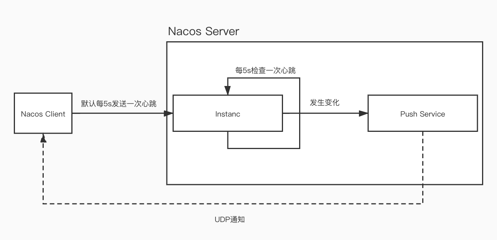

# Nacos-注册中心-注册过程源码分析

[toc]


## 前戏

* 版本问题：
    * Nacos版本1.2.1
    * Spring-Cloud-Alibaba版本2.2.1
    * Nacos Client SDK版本1.2.1
* 部分代码会将不重要的地方忽略，导致变量找不到声明和赋值地方，这都不重要。


## 注册入口

​	我们用Spring-Cloud-Alibaba（以下简称SCA）来对nacos注册流程进行探讨。

​		首先要想使用nacos的注册功能，需要先引入注册用的starter。

```xml
<dependency>
  <groupId>com.alibaba.cloud</groupId>
  <artifactId>spring-cloud-starter-alibaba-nacos-discovery</artifactId>
</dependency>
```

​		Spring-Cloud规范提供了一个ServiceRegistry的接口类用来各种注册中心的快捷接入。对于SCA中的Nacos而言，其具体实现类为NacosServiceRegistry。也就是当触发了ServiceRegistry的register方法其实就是触发了NacosServiceRegistry的register方法。

```java
@Override
public void register(Registration registration) {
  String serviceId = registration.getServiceId();
  String group = nacosDiscoveryProperties.getGroup();
  Instance instance = getNacosInstanceFromRegistration(registration);
  try {
    namingService.registerInstance(serviceId, group, instance);
  }
  catch (Exception e) {
  }
}
```

​		这个starter实际上是调用了Nacos CLient SDK中的NacosNamingService.registerInstance完成注册。

```java
@Override
public void registerInstance(String serviceName, String groupName, Instance instance) throws NacosException {

  if (instance.isEphemeral()) {
    BeatInfo beatInfo = new BeatInfo();
    beatInfo.setServiceName(NamingUtils.getGroupedName(serviceName, groupName));
    beatInfo.setIp(instance.getIp());
    beatInfo.setPort(instance.getPort());
    beatInfo.setCluster(instance.getClusterName());
    beatInfo.setWeight(instance.getWeight());
    beatInfo.setMetadata(instance.getMetadata());
    beatInfo.setScheduled(false);
    beatInfo.setPeriod(instance.getInstanceHeartBeatInterval());

    beatReactor.addBeatInfo(
      NamingUtils.getGroupedName(serviceName, groupName), beatInfo
    );
  }
  serverProxy.registerService(
    NamingUtils.getGroupedName(serviceName, groupName), groupName, instance
  );
}

//Instance 类
public long getInstanceHeartBeatInterval() {
  return this.getMetaDataByKeyWithDefault(
    "preserved.heart.beat.interval",Constants.DEFAULT_HEART_BEAT_INTERVAL
  );
}

//Constants 类
public static final long DEFAULT_HEART_BEAT_INTERVAL;
static {
  DEFAULT_HEART_BEAT_TIMEOUT = TimeUnit.SECONDS.toMillis(15L);
  DEFAULT_IP_DELETE_TIMEOUT = TimeUnit.SECONDS.toMillis(30L);
  DEFAULT_HEART_BEAT_INTERVAL = TimeUnit.SECONDS.toMillis(5L);
}
```

​		NacosNamingService.registerInstance方法主要逻辑就是通过beatReactor.addBeatInfo建立心跳检测机制，其中period是心跳频率默认是5s，健康超时是15s，将ip信息删除是30s。serverProxy.registerService实现服务的注册。

## 健康检查机制

### Client端

​		心跳机制是在通过注册服务来触发的，它是保证服务提供者健康状态的重要途径，具体代码如下：

```java
public void addBeatInfo(String serviceName, BeatInfo beatInfo) {
        String key = buildKey(serviceName, beatInfo.getIp(), beatInfo.getPort());
        BeatInfo existBeat = null;
        if ((existBeat = dom2Beat.remove(key)) != null) {
            existBeat.setStopped(true);
        }
        dom2Beat.put(key, beatInfo);
        executorService.schedule(new BeatTask(beatInfo), beatInfo.getPeriod(), 
                                 TimeUnit.MILLISECONDS);
        MetricsMonitor.getDom2BeatSizeMonitor().set(dom2Beat.size());
    }
```

​		由上看出，心跳是Client通过schedule定时发送的。而BeatTask的run方法究竟干了什么，看下面代码：

```java
@Override
public void run() {
  if (beatInfo.isStopped()) {
    return;
  }
  long nextTime = beatInfo.getPeriod();
  try {
    JSONObject result = serverProxy.sendBeat(beatInfo, BeatReactor.this.lightBeatEnabled);
    long interval = result.getIntValue("clientBeatInterval");
    boolean lightBeatEnabled = false;
    if (result.containsKey(CommonParams.LIGHT_BEAT_ENABLED)) {
      lightBeatEnabled = result.getBooleanValue(CommonParams.LIGHT_BEAT_ENABLED);
    }
    BeatReactor.this.lightBeatEnabled = lightBeatEnabled;
    if (interval > 0) {
      nextTime = interval;
    }
    int code = NamingResponseCode.OK;
    if (result.containsKey(CommonParams.CODE)) {
      code = result.getIntValue(CommonParams.CODE);
    }
    if (code == NamingResponseCode.RESOURCE_NOT_FOUND) {
      Instance instance = new Instance();
      instance.setInstanceId(instance.getInstanceId());
      instance.setEphemeral(true);
      //set...
      try {
        //注册
        serverProxy.registerService(
          beatInfo.getServiceName(),
         	NamingUtils.getGroupName(beatInfo.getServiceName()), 
          instance
        );
      } catch (Exception ignore) {
      }
    }
  } catch (NacosException ne) {
    //...
  }
  executorService.schedule(new BeatTask(beatInfo), nextTime, TimeUnit.MILLISECONDS);
}
```

​		通过serverProxy.sendBeat方法向Server端发送心跳请求，实际上也是使用的OpenAPI进行请求的。请求API为（/v1/ns/instance/beat），方法为PUT。

​		如果这个服务不存在，那么就根据心跳信息里的数据构建出服务数据，然后向Server端进行注册。最后将任务从新交由周期线程执行。

### Server端

#### 心跳请求处理

```java
@CanDistro
@PutMapping("/beat")
@Secured(parser = NamingResourceParser.class, action = ActionTypes.WRITE)
public JSONObject beat(HttpServletRequest request) throws Exception {
  JSONObject result = new JSONObject();
  //...
  RsInfo clientBeat = null;
  if (StringUtils.isNotBlank(beat)) {
    clientBeat = JSON.parseObject(beat, RsInfo.class);
  }

  if (clientBeat != null) {
    if (StringUtils.isNotBlank(clientBeat.getCluster())) {
      clusterName = clientBeat.getCluster();
    } else {
      clientBeat.setCluster(clusterName);
    }
    ip = clientBeat.getIp();
    port = clientBeat.getPort();
  }
  //获取服务
  Instance instance = serviceManager.getInstance(
    namespaceId, serviceName, clusterName, ip, port
  );

  if (instance == null) {
    if (clientBeat == null) {
      result.put(CommonParams.CODE, NamingResponseCode.RESOURCE_NOT_FOUND);
      return result;
    }
    instance = new Instance();
    instance.setPort(clientBeat.getPort());
    //set ... from clientBeat
    //没有就注册
    serviceManager.registerInstance(namespaceId, serviceName, instance);
  }

  Service service = serviceManager.getService(namespaceId, serviceName);

  if (service == null) {
    throw new NacosException(NacosException.SERVER_ERROR,
                             "service not found: " + serviceName + "@" + namespaceId);
  }
  if (clientBeat == null) {
    clientBeat = new RsInfo();
    clientBeat.setIp(ip);
    clientBeat.setPort(port);
    clientBeat.setCluster(clusterName);
  }
  //处理心跳信息
  service.processClientBeat(clientBeat);

  result.put(CommonParams.CODE, NamingResponseCode.OK);
  result.put("clientBeatInterval", instance.getInstanceHeartBeatInterval());
  result.put(SwitchEntry.LIGHT_BEAT_ENABLED, switchDomain.isLightBeatEnabled());
  return result;
}
```

​		服务端接收到心跳请求会先根据信息去调用serviceManager.getInstance来获取本地是否已经注册过这个服务了，如果没有就调用serviceManager.registerInstance去创建（Server创建后文会详细讲）。最后调用service.processClientBeat去处理心跳数据。

```java
public void processClientBeat(final RsInfo rsInfo) {
  ClientBeatProcessor clientBeatProcessor = new ClientBeatProcessor();
  clientBeatProcessor.setService(this);
  clientBeatProcessor.setRsInfo(rsInfo);
  HealthCheckReactor.scheduleNow(clientBeatProcessor);
}

public class ClientBeatProcessor implements Runnable {
  @Override
  public void run() {
    Service service = this.service;
    String ip = rsInfo.getIp();
    String clusterName = rsInfo.getCluster();
    int port = rsInfo.getPort();
    Cluster cluster = service.getClusterMap().get(clusterName);
    List<Instance> instances = cluster.allIPs(true);

    for (Instance instance : instances) {
      if (instance.getIp().equals(ip) && instance.getPort() == port) {
        instance.setLastBeat(System.currentTimeMillis());
        if (!instance.isMarked()) {
          if (!instance.isHealthy()) {
            instance.setHealthy(true);
            //udp推送
            getPushService().serviceChanged(service);
          }
        }
      }
    }
  }
}
```

​		Server端会异步去重设这个服务的最后一次心跳时间，并且如果这个服务信息已经变更了，那么就使用PushService通过UDP进行信息的主动推送（变更通知会在后文介绍）。

#### 心跳定时检查

​		上面的介绍并没有提及如果心跳停止，将会如何知道和处理的。其实这部分功能是通过异步任务来完成的。这个任务是什么创建的呢，其实是在Service创建的同时进行的，并且5s检查一次：

```java
public class Service extends com.alibaba.nacos.api.naming.pojo.Service 
  implements Record,RecordListener<Instances> {
    @JSONField(serialize = false)
    private ClientBeatCheckTask clientBeatCheckTask = new ClientBeatCheckTask(this);

    public void init() {
      //定时检查
      HealthCheckReactor.scheduleCheck(clientBeatCheckTask);
      for (Map.Entry<String, Cluster> entry : clusterMap.entrySet()) {
        entry.getValue().setService(this);
        entry.getValue().init();
      }
    }
}

//HealthCheckReactor 类
public static void scheduleCheck(ClientBeatCheckTask task) {
  futureMap.putIfAbsent(
    task.taskKey(), EXECUTOR.scheduleWithFixedDelay(task, 5000, 5000, TimeUnit.MILLISECONDS)
  );
}
```

​		这个clientBeatCheckTask检查任务的逻辑就是判断当前时间和心跳超时时间以及IP清除超时间比较。心跳超时了就将健康状态置为不健康，并且通过事件进行数据一致性的同步处理；IP清除超时了就通过OpenAPI调用自己来删除Instance，OpenAPI为（/v1/ns/instance）,方法为DELETE。

​		从调用OpenAPI以及任务的代码也能看出来，这个检查其实是Instance级别的。

```java

public class ClientBeatCheckTask implements Runnable {
	@Override
  public void run() {
    try {
			//...
      List<Instance> instances = service.allIPs(true);

      // first set health status of instances:
      for (Instance instance : instances) {
        if (System.currentTimeMillis() - instance.getLastBeat() >
            instance.getInstanceHeartBeatTimeOut()) {
          if (!instance.isMarked()) {
            if (instance.isHealthy()) {
              instance.setHealthy(false);
              getPushService().serviceChanged(service);
              //发送事件，同步数据
              SpringContext.getAppContext().publishEvent(
                new InstanceHeartbeatTimeoutEvent(this, instance));
            }
          }
        }
      }
			//...
      // then remove obsolete instances:
      for (Instance instance : instances) {
        if (instance.isMarked()) {
          continue;
        }
        if (System.currentTimeMillis() - instance.getLastBeat() > 
            instance.getIpDeleteTimeout()) {
          // delete instance
          deleteIP(instance);
        }
      }

    } catch (Exception e) {
      Loggers.SRV_LOG.warn("Exception while processing client beat time out.", e);
    }
  }
}

private void deleteIP(Instance instance) {
  try {
    NamingProxy.Request request = NamingProxy.Request.newRequest();
    //...
    String url = "http://127.0.0.1:" + RunningConfig.getServerPort() + 
      RunningConfig.getContextPath() + UtilsAndCommons.NACOS_NAMING_CONTEXT + 
      "/instance?" + request.toUrl();

    // delete instance asynchronously...
    //...
  } catch (Exception e) {
    //...
  }
}
```

#### 健康检查

​		我们再来看一下上面service.init方法中的entry.getValue().init方法，他调用的是Cluster类的init方法,正常情况下，创建service时cluster是空的（下面会分析创建service），但是这里却还是init了一下，我个人认为是因为这个service的init过程并没有加锁，也就可能在把service放到内存后，调用cluster的init前被注册了cluster，所以这里做了下兼容，并且cluster内部一进来就判断了是否init过，避免重复初始化。

​		我们就在这一小节直接对这个cluster的init进行一下分析：

```java
public void init() {
    if (inited) {
        return;
    }
    checkTask = new HealthCheckTask(this);

    HealthCheckReactor.scheduleCheck(checkTask);
    inited = true;
}
```

​		关键点是这个HealthCheckTask任务，来分析一下他的代码：

```java
//构造函数
public HealthCheckTask(Cluster cluster) {
    this.cluster = cluster;
    distroMapper = SpringContext.getAppContext().getBean(DistroMapper.class);
    switchDomain = SpringContext.getAppContext().getBean(SwitchDomain.class);
    healthCheckProcessor = 
      SpringContext.getAppContext().getBean(HealthCheckProcessorDelegate.class);
    initCheckRT();
}

@Override
public void run() {
  try {
    if (distroMapper.responsible(cluster.getService().getName()) &&
        switchDomain.isHealthCheckEnabled(cluster.getService().getName())) {
      //检查  
      healthCheckProcessor.process(this);
    }
  } catch (Throwable e) {
  } finally {
    if (!cancelled) {
      HealthCheckReactor.scheduleCheck(this);
      //...
    }
  }
}

//HealthCheckProcessorDelegate 类
@Override
public void process(HealthCheckTask task) {

  String type = task.getCluster().getHealthChecker().getType();
  HealthCheckProcessor processor = healthCheckProcessorMap.get(type);
  if(processor == null){
    processor = healthCheckProcessorMap.get(NoneHealthCheckProcessor.TYPE);
  }

  processor.process(task);
}
```

​		构造函数中值得注意的是healthCheckProcessor字段，它是HealthCheckProcessorDelegate的实例，是一种策略模式的体现。从healthCheckProcessor.process方法可以看出，选用何种健康检查方法，是根据cluster里healthChecker的type来决定的，那么默认值是什么呢，来看下Cluster类：

```java
/**
 * Health check config of this cluster
 */
private AbstractHealthChecker healthChecker = new AbstractHealthChecker.Tcp();
```

​		默认是Tcp方式，而且是设置在Cluster的顶层类中（他有个不同包却同名的子类）。检查方式的具体逻辑下文继续介绍，我们先看下这检查方式要怎么去扩展。

##### 检查方式的扩展点

​		我们再回过头来看看HealthCheckProcessorDelegate类，主要看下他的构造函数：

```java
public HealthCheckProcessorDelegate(HealthCheckExtendProvider provider) {
    provider.init();
}
```

​		传进来个HealthCheckExtendProvider的实例，看类名，extend-扩展，直接道明了他的作用。来看它的init方法干了什么：

```java
//扩展方式
private ServiceLoader<HealthCheckProcessor> processorLoader
  = ServiceLoader.load(HealthCheckProcessor.class);
private ServiceLoader<AbstractHealthChecker> checkerLoader
  = ServiceLoader.load(AbstractHealthChecker.class);

public void init(){
    loadExtend();
}
private void loadExtend() {
    Iterator<HealthCheckProcessor> processorIt = processorLoader.iterator();
    Iterator<AbstractHealthChecker> healthCheckerIt = checkerLoader.iterator();

    Set<String> origin = new HashSet<>();
    for(HealthCheckType type : HealthCheckType.values()){
        origin.add(type.name());
    }
    Set<String> processorType = new HashSet<>();
    Set<String> healthCheckerType = new HashSet<>();
    processorType.addAll(origin);
    healthCheckerType.addAll(origin);

    while(processorIt.hasNext()){
        HealthCheckProcessor processor = processorIt.next();
        String type = processor.getType();
        if(processorType.contains(type)){
            throw new RuntimeException("More than one processor of the same type was found : 
                                       [type=\"" + type + "\"]");
        }
        processorType.add(type);
        //交给spring                               
        registry.registerSingleton(lowerFirstChar(processor.getClass().getSimpleName()), 
                                   processor);
    }

    while(healthCheckerIt.hasNext()){
        AbstractHealthChecker checker = healthCheckerIt.next();
        String type = checker.getType();
        if(healthCheckerType.contains(type)){
            throw new RuntimeException("More than one healthChecker of the same type was 
                                       found : [type=\"" + type + "\"]");
        }
        healthCheckerType.add(type);
        HealthCheckType.registerHealthChecker(checker.getType(), checker.getClass());
    }
		//...
}
```

​		恍然大悟！Nacos用了ServiceLoader这个SPI去进行扩展，你只需要在META-INF/services下的，以对应接口全限定名命名的文件下，加上你扩展的类的全限定名就万事大吉了。这应该是给后续迭代或者我们改造Nacos定制适合自己业务的检测机制用的扩展点，这个方式可以减少对原代码的修改。

​		看完扩展点，也该来看下Nacos自带的几种检测机制的实现了，下面就发车，车门焊死！

##### TCP检测方式


##### HTTP检测方式


##### MYSQL检测方式


#### 小结图示



## 注册Instance

### @CanDistro

​		客户端调用了OpenAPI后，进入Nacos的Naming模块中的InstanceController，POST方法对应着注册Instance，代码如下：

```java
@CanDistro
@PostMapping
@Secured(parser = NamingResourceParser.class, action = ActionTypes.WRITE)
public String register(HttpServletRequest request) throws Exception {
	//...
  serviceManager.registerInstance(namespaceId, serviceName, parseInstance(request));
  return "ok";
}
```

​		我们会发现方法上有个@CanDistro注解。这个注解很重要。它决定着这个请求是不是在这个Nacos实例上进行处理。对请求的处理是通过过滤链来进行判断处理的，我们来结合DistroFilter.doFilter代码具体分析：

```java
@Override
public void doFilter(ServletRequest servletRequest, ServletResponse servletResponse, 
                     FilterChain filterChain) throws IOException, ServletException {
  //...
  try {
		//...
    String groupName = req.getParameter(CommonParams.GROUP_NAME);
    if (StringUtils.isBlank(groupName)) {
      groupName = Constants.DEFAULT_GROUP;
    }

    // use groupName@@serviceName as new service name:
    String groupedServiceName = serviceName;
    if (StringUtils.isNotBlank(serviceName) && 
        !serviceName.contains(Constants.SERVICE_INFO_SPLITER)) {
      groupedServiceName = groupName + Constants.SERVICE_INFO_SPLITER + serviceName;
    }

    // proxy request to other server if necessary:
    if (method.isAnnotationPresent(CanDistro.class) && 
        !distroMapper.responsible(groupedServiceName)) {
      //...
      List<String> headerList = new ArrayList<>(16);
      Enumeration<String> headers = req.getHeaderNames();
      while (headers.hasMoreElements()) {
        String headerName = headers.nextElement();
        headerList.add(headerName);
        headerList.add(req.getHeader(headerName));
      }

      String body = IoUtils.toString(req.getInputStream(), Charsets.UTF_8.name());

      HttpClient.HttpResult result =
        HttpClient.request("http://" + distroMapper.mapSrv(groupedServiceName) + 
                           req.getRequestURI(), headerList,
                           HttpClient.translateParameterMap(req.getParameterMap()),
                           body, PROXY_CONNECT_TIMEOUT, PROXY_READ_TIMEOUT, 
                           Charsets.UTF_8.name(), req.getMethod());
			//...resp
      return;
    }
    OverrideParameterRequestWrapper requestWrapper = 
      OverrideParameterRequestWrapper.buildRequest(req);
    requestWrapper.addParameter(CommonParams.SERVICE_NAME, groupedServiceName);
    filterChain.doFilter(requestWrapper, resp);
    //...catch
  } catch (Exception e) {
    resp.sendError(HttpServletResponse.SC_INTERNAL_SERVER_ERROR,
                   "Server failed," + ExceptionUtil.getAllExceptionMsg(e));
    return;
  }
}

public boolean responsible(String serviceName) {
  if (!switchDomain.isDistroEnabled() || SystemUtils.STANDALONE_MODE) {
    return true;
  }
	//...
  int index = healthyList.indexOf(NetUtils.localServer());
  int lastIndex = healthyList.lastIndexOf(NetUtils.localServer());
  if (lastIndex < 0 || index < 0) {
    return true;
  }
	//hash计算
  int target = distroHash(serviceName) % healthyList.size();
  return target >= index && target <= lastIndex;
}
```

​		根据请求URL获取Controller Method，如果这个Method有标注@CanDistro注解，以及经过distroMapper.responsible方法的判断，这个请求不应该由本机处理（通过groupedServiceName和healthyList大小的哈希计算判断），那么就会将这个请求转发给由distroMapper.mapSrv方法（也是和刚才相同的哈希计算方式）算出的Nacos实例来进行处理。

​		当然，这只是请求的处理，当前Nacos实例只是将信息在内存中进行了缓存。如果是持久节点，注册数据的持久化是用Nacos自己实现的轻量版Raft算法进行集群数据同步的，属于CP模型，数据持久化是会被转发到Leader上进行处理，这部分内容会在Raft数据同步篇详细分析介绍。这样的话即使你刚注册完毕又立即去读取（还没被Leader进行集群同步），由于是交由同一个Nacos实例处理，该实例里已经有了刚才的缓存，还是能正常使用的，也体现了AP的特点。

### 创建service

​		再回到InstanceController.register方法中来，它调用了serviceManager.registerInstance来实现service的注册：

```java
/**
 * Register an instance to a service in AP mode.
 * <p>
 * This method creates service or cluster silently if they don't exist.
 *
 * @param namespaceId id of namespace
 * @param serviceName service name
 * @param instance    instance to register
 * @throws Exception any error occurred in the process
 */
public void registerInstance(String namespaceId, String serviceName, Instance instance) throws NacosException {

    createEmptyService(namespaceId, serviceName, instance.isEphemeral());

    Service service = getService(namespaceId, serviceName);

    if (service == null) {
        throw new NacosException(NacosException.INVALID_PARAM,
            "service not found, namespace: " + namespaceId + ", service: " + serviceName);
    }

    addInstance(namespaceId, serviceName, instance.isEphemeral(), instance);
}
```

​		可以看到就连方法注释都写明了，是以AP模式去创建的service。这也是Nacos作为注册中心与Zookeeper关键性的区别。Zookeeper是CP模式，个人理解注册中心更应该保持的是可用性，而不是一致性，所以CAP理论中AP模式应该是更适合注册中心的。

​		注册第一步是先去初始化出来一个service，接下来将instance注册到nacos内。先来分析初始化一个service的代码：

```java
public void createEmptyService(String namespaceId, String serviceName, boolean local) throws 
  	NacosException {
 	 	createServiceIfAbsent(namespaceId, serviceName, local, null);
}

public void createServiceIfAbsent(String namespaceId, String serviceName, boolean local, 
                                  Cluster cluster) throws NacosException {
    Service service = getService(namespaceId, serviceName);
    if (service == null) {

        service = new Service();
        service.setName(serviceName);
        service.setNamespaceId(namespaceId);
        service.setGroupName(NamingUtils.getGroupName(serviceName));
        // now validate the service. if failed, exception will be thrown
        service.setLastModifiedMillis(System.currentTimeMillis());
        service.recalculateChecksum();
        if (cluster != null) {
            cluster.setService(service);
            service.getClusterMap().put(cluster.getName(), cluster);
        }
        service.validate();

        putServiceAndInit(service);
        if (!local) {
            addOrReplaceService(service);
        }
    }
}

private void putServiceAndInit(Service service) throws NacosException {
  	putService(service);
  	service.init();
    consistencyService.listen(
      KeyBuilder.buildInstanceListKey(service.getNamespaceId(),service.getName(), true),
      																service);
  	consistencyService.listen(
      KeyBuilder.buildInstanceListKey(service.getNamespaceId(),service.getName(), false),
                              				service);
}

```

​		如果service不存在，那就创建一个新的service。然后调用putServiceAndInit方法把service放入serviceMap的内存缓冲中（Map<namespace, Map<group::serviceName, Service>>），再调用service.init()进行初始化，最后将service注册给处理一致性的服务监听。

​		我们先看下service.init方法（前面在心跳部分也讲过一部分），这个方法先进行了开启检查instance心跳的异步任务。然后又将属于该service的cluster进行初始化（注：这个cluster不是nacos的cluster，是两个不同概念，可以从web操作界面看出来，级别是 service>cluster>instance）,init代码如下：

```java
public void init() {
    HealthCheckReactor.scheduleCheck(clientBeatCheckTask);
    for (Map.Entry<String, Cluster> entry : clusterMap.entrySet()) {
        entry.getValue().setService(this);
        entry.getValue().init();
    }
}
```


​		我们先看下最后的consistencyService.listen方法，他是由DelegateConsistencyServiceImpl类进行实现的。