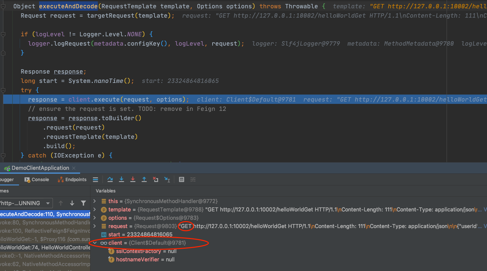
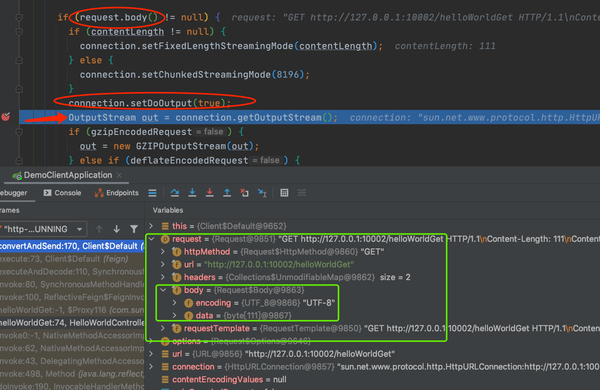
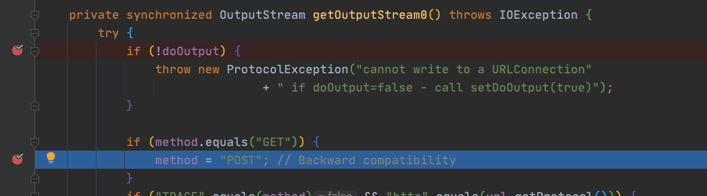

# Feign将Get请求变成了Post原因调查

[toc]

## 问题展示

​		最近遇到使用spring-cloud的feign时遇到了一个奇怪的问题，我发出的Get请求被改成Post请求，返回结果如下:

```json
[
    {
        "timestamp":"2020-08-10T08:00:58.416+0000",
        "status":405,
        "error":"Method Not Allowed",
        "message":"Request method 'POST' not supported",
        "path":"/helloWorldGet"
    }
]
```

​		居然告诉我405，Post的方法不支持！可我是Get请求啊，相关代码如下，调用的是helloWorldGet方法：

```java
@Api(tags = "helloWorld")
public interface IHelloWorldController {

    @ApiOperation(value = "test post",notes = "test post")
    @PostMapping(value = "/helloWorldPost",consumes = MediaType.APPLICATION_JSON_VALUE)
    BaseResponse<HelloWorldResponse> helloWorldPost(@RequestBody HelloWorldRequest req);

    @ApiOperation(value = "test get",notes = "test get")
    @GetMapping(value = "/helloWorldGet",consumes = MediaType.APPLICATION_JSON_VALUE)
    BaseResponse<HelloWorldResponse> helloWorldGet(@RequestBody HelloWorldRequest req);

    @GetMapping(value = "/healthy")
    String healthy();
}
```

​		上面是相关API，下面是Feign的client，直接继承的上面的接口:

```java
@FeignClient(
        contextId = "helloWorldFeignClient",
        value = "demo-server",
        url = "${demo-server.url}"
)
public interface HelloWorldFeignClient extends IHelloWorldController {

}
```

​		

## Feign源码跟踪

​		看着配的是Get的注解啊，问题出在哪了呢，于是我debug了一下代码中调用feign client的地方：

```java
@ApiOperation(value = "test get",notes = "test get")
@GetMapping("/testget")
public String helloWorldGet() {
    HelloWorldRequest req = new HelloWorldRequest();
    //...省略参数封装
  	//debug这里
    return helloWorldFeignClient.helloWorldGet(req).toString();
}
```

​		一路debug，来到了SynchronousMethodHandler类的executeAndDecode方法：



​		由截图可以看到，到这一步，还是Get方法呢，然后再留意一下client的类型，是Default的。我们继续进入client.execute这个方法内：

```java
//feign.Client.Default#execute

@Override
public Response execute(Request request, Options options) throws IOException {
  HttpURLConnection connection = convertAndSend(request, options);
  return convertResponse(connection, request);
}
```

​		进入的是Client接口的一个默认实现Default类，这个类使用的是HttpURLConnection去请求http接口，那我们继续进入convertAndSend方法中debug：



​		看一下关键点，这个Get请求是有body的，所以将doOutput设置为了true，再跟进connection.getOutputStream()方法：



​		到这就真相大白了！默认情况下，如果Get请求携带了body，那么它就会被改成Post请求，从而造成了405错误的发生。


## 解决方法

​		既然产生问题的原因找到了，也就有思路去解决掉它了。

* Get方法不使用body，也就是不写@RequestBody注解，但是也不能啥也不写，会被Feign默认成带这个注解，弄成body，要加@RequestParam注解，也就是使用标准的Get请求方式。
* 如果你想在Get里使用body，那也是有办法的，既然是默认会改成Post的，那我换一种实现方式不就好了嘛：

```xml
<dependency>
   <groupId>org.apache.httpcomponents</groupId>
   <artifactId>httpclient</artifactId>
</dependency>
<dependency>
   <groupId>io.github.openfeign</groupId>
   <artifactId>feign-httpclient</artifactId>
</dependency>
```

​		引入以上依赖，会用新的Client实现以及其他的HttpClient去避免不兼容Get请求不允许带body的情况。


欢迎关注我的个人微信公众号`ymxd-it`，也可扫下面的码关注：


